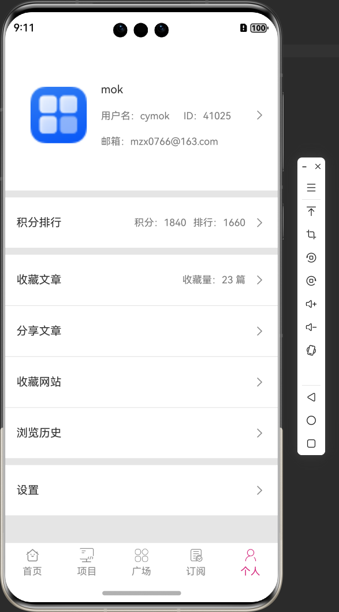
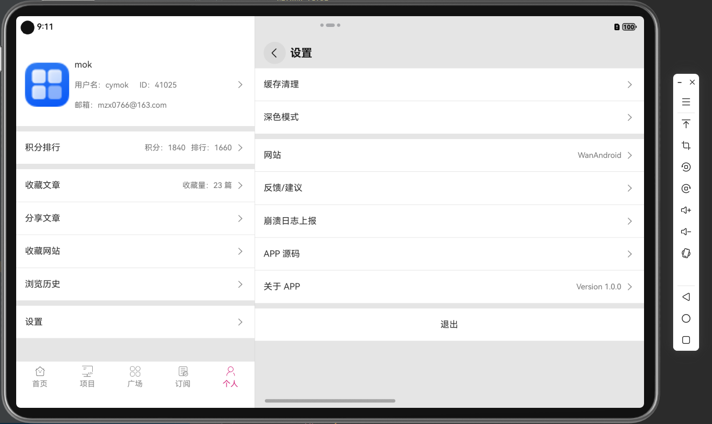

# 一款 HarmonyOS 5.0.0(12) 版的 WanAndroid App

api 和官方网站 <https://www.wanandroid.com>

"compatibleSdkVersion": "5.0.0(12)"

## 效果

### 手机端

<div style="display: flex; justify-content: space-between;">
    
    
    
</div>

### 折叠屏


### 平板端




<!-- 0.3 倍缩放 -->

### others


## 功能和技术点

- [x] 网络：使用原生 NetworkKit 的 http 进行网络请求（可选三方库 @ohos/axios）
- [x] 图片：使用原生 Image（可选三方库 @ohos/imageknife）
- [x] 状态管理：使用 V1 稳定版。
- [x] 数据持久化：使用原生 PersistentStorage 持久化存储做 cookies 的处理（可选三方库 @tencent/mmkv）
- [x] 页面路由：原生 NavPathStack + Navigation + NavDestination（可选三方库 @hadss/hmrouter、@hzw/zrouter）
- [x] 首页使用 Tabs 组件，自定义 tabBar
- [x] 页面刷新和加载更多：使用原生 Refresh 组件的 onRefreshing 进行刷新；使用 List 的 onReachEnd 进行加载更多。（可选三方库 @abner/refresh、@ohos/pulltorefresh）
- [x] 适配不同宽度的页面，PersonPage 已使用 Flex 适配

---

- [ ] 调用第三方 App，例如：浏览器、邮件应用、应用商店
- [ ] Web 页面，收藏、刷新、复制链接、从浏览器打开、分享
- [ ] 浏览历史，本地数据处理，可使用简单数据存储（@tencent/mmkv）或数据库（@liushengyi/smartdb、@ohos/dataorm）

- [ ] 完善其它接口的页面
- [ ] 引入 apm_harmony_sdk（APMSDK 拥有以下应用监控能力：采集上报App启动性能、崩溃、卡顿、错误信息、网络请求、终端设备、自定义事件等）

## 开发过程中的一些记录

### 接口要求以表单提交参数

即 `Content-Type = application/x-www-form-urlencoded`，那么，参数是要以键值对形式提交的（`a=b&c=d`），而不是 json
字符串（`{a:b,c:d}`），并且是经过 UrlEncoded 的

```typescript
httpRequest.request(
  url,
  {
    method: http.RequestMethod.POST,
    header: {
      // 'Content-Type': 'application/json' // 数据以 JSON 格式发送，通常是一个字符串化的对象。
      'Content-Type': 'application/x-www-form-urlencoded' // 数据以键值对形式发送，格式为 key1=value1&key2=value2。特殊字符会被编码
    },
    // extraData: requestJson,
    extraData: JsonUtils.jsonToUrlEncoded(requestJson),
  },
  (err, data) => {
    if (!err) {
      console.log(`data.responseCode = ${data.responseCode}`)
      let obj: ApiResult<UserInfo>
      if (data.responseCode == 200) {
        // 接口返回
        // obj = JsonUtils.json2Obj<ApiResult<UserInfo>>(data.result.toString())
        obj = JSON.parse(data.result.toString()) as ApiResult<UserInfo>
        console.log(`obj = ${obj}`)
        console.log(`obj.errorCode = ${obj.errorCode}`)
        if (obj.errorCode == 0) {
          // 接口正常返回
          resolve(obj);
        } else {
          // 接口错误码
          let apiErr = new Error(obj.errorMsg)
          reject(apiErr)
        }
      }
    } else {
      console.error(`err = ${err}`)
      reject(err);
    }
    httpRequest.destroy();
  });
```

### cookies 的处理

这是某次返回的 cookies。可见一共有 5 个 cookie，index = 5 的是 key，index = 6 的是 value

```
#HttpOnly_www.wanandroid.com	FALSE	/	TRUE	0	JSESSIONID	84D02569FC8883FD676A1439F8F6CD909527
 www.wanandroid.com	FALSE	/	FALSE	1732222984	loginUserName	cymok
 www.wanandroid.com	FALSE	/	FALSE	1732222984	token_pass	7c934a41fee93d67b5bcc9c25d498f48
 .wanandroid.com	TRUE	/	FALSE	1732222984	loginUserName_wanandroid_com	cymok
 .wanandroid.com	TRUE	/	FALSE	1732222984	token_pass_wanandroid_com	7c934a41fee93d67b5bcc9c25d498f48
```

按照以上逻辑，取出处理，然后做持久化，下次就可以带上继续请求了

```typescript
// cookies 是接口返回的 cookies，格式是 string
const cookieArray = cookies.trim().split('\n')
const formattedCookies = cookieArray.map(line => {
  const parts = line.split('\t')
  return `${parts[5]}=${parts[6]}` // parts[5] 是 cookie 名称，parts[6] 是 cookie 值
}).join('; ')
```

### Webview

微信文章需要开启 DOM

```typescript
Web().domStorageAccess(true) // 开启 DOM 存储 例如 微信文章 需要
```

### 适配 Tablet、Foldable

利用 Flex 组件，适配了不同宽度的页面。PersonPage 已经适配好。

Flex 文档 <https://developer.huawei.com/consumer/cn/doc/harmonyos-guides-V5/arkts-layout-development-flex-layout-V5>

### 